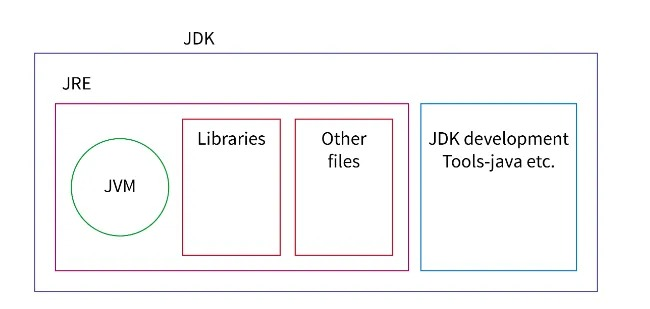
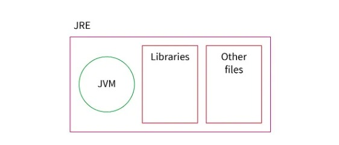
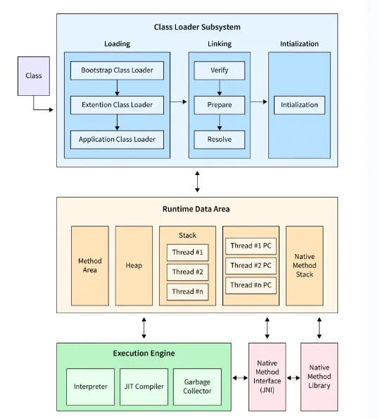
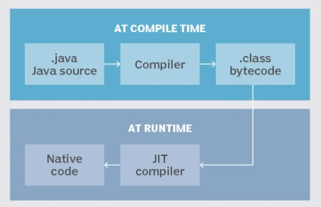
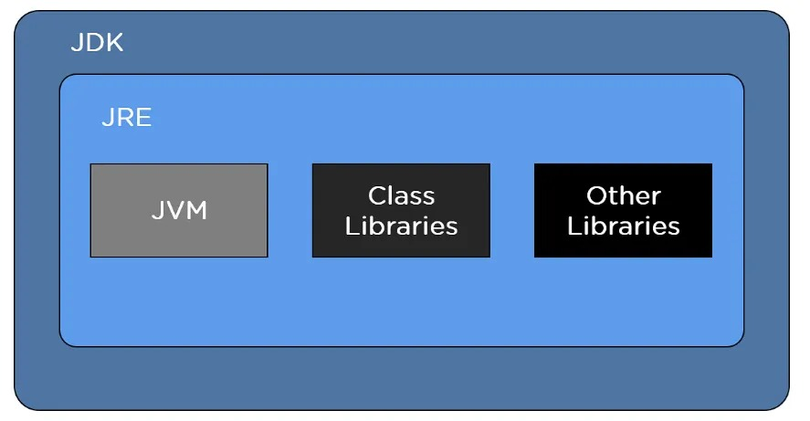
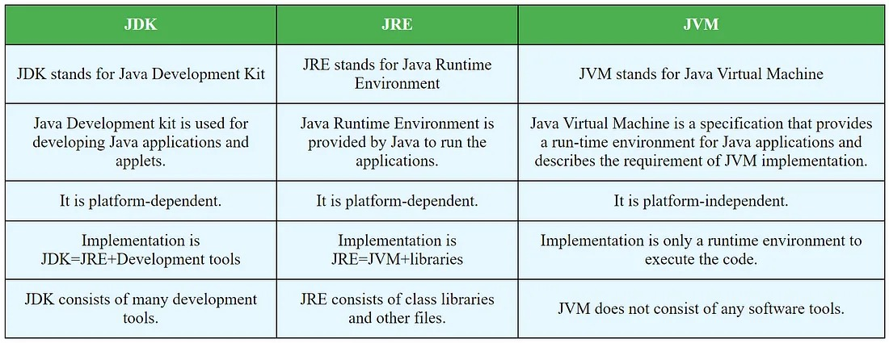

---

# ☕ Java Components: JDK, JRE, JVM, and JIT

Java is a widely-used programming language known for its platform independence and versatility. To fully understand how Java runs programs, it's essential to understand the key components: **JDK**, **JRE**, **JVM**, and **JIT**.

---

## 🔧 Java Development Kit (JDK)

* **Full Form**: Java Development Kit
* **Purpose**: Used for building and developing Java applications
* **Includes**:

  * Java Compiler (`javac`)
  * Java Debugger
  * Development tools
  * All necessary libraries and files
* **Contains**: JRE (Java Runtime Environment)
* **Without JDK**: You cannot **develop or compile** Java programs

* **Architecture**

### 🛠️ JDK Architecture & Working:

1. **Compilation**: Java code → Bytecode via `javac`
2. **Execution**: Bytecode executed by JVM (inside JDK)
3. **Debugging**: Tools provided by JDk to find and fix bugs

---

## 🖥️ Java Runtime Environment (JRE)

* **Full Form**: Java Runtime Environment
* **Purpose**: To **run** Java programs
* **Includes**:

  * JVM
  * Core libraries (`java.lang`, `java.io`, etc.)
* **Without JRE**: Java programs **cannot run**
* **With only JRE**: You can **run** Java programs, but **not develop** them

### ⚙️ JRE Architecture:

* **ClassLoader**: Loads Java classes when needed
* **Bytecode Verifier**: Ensures code safety and format
* **Interpreter**: Converts bytecode into machine-understandable instructions

* **Architecture**

---

## ⚙️ Java Virtual Machine (JVM)

* **Full Form**: Java Virtual Machine
* **Purpose**:

  * Converts bytecode into **machine code**
  * Provides a **runtime environment**
* **Platform-Dependent**: JVM is implemented differently for each OS
* **Contains**: JIT (Just-In-Time Compiler)

* **Responsibilities**:

  * Loads `.class` files
  * Verifies & executes bytecode
  * Manages memory (Garbage Collection)

* **Architecture**

### 🏗️ JVM Working:

1. **Loading**: Brings `.class` files into memory
2. **Linking**: Here, the bytecode verification takes place. The class file is parsed by the JVM and divided into basic elements like methods, fields, etc. It is important to verify the bytecode to prevent unauthorized access and ensure memory safety.
3. **Initialization**: Executes static blocks & initializers
4. **Execution**: Starts with `main()` method (called by JVM)

> Tech Fact: Who is responsible to call main() method of java?
> Ans: JVM is actually responsible for calling the main() method of java.

> During runtime, JVM becomes an instance of JRE

---

## ⚡ Just-In-Time (JIT) Compiler

* **Full Form**: Just In Time Compiler
* **Purpose**: Improves performance by **compiling bytecode to native machine code** at runtime
* **Enhancement**: Makes Java a **compiled + interpreted** language
* **Introduced In**: JDK 1.2
* **Optimizes**: Hotspot code (frequently executed code blocks)

* **Architecture**

---

## Final Architecture of JDK

> Note: JDK contains JRE, JRE contains JVM, JVM contains JIT
> Hence, once if we install JDK all the other components gets installed

---

## The difference between JDK, JRE, and JVM is as follows-

---

## ✅ Summary Table

| Component | Full Form                | Purpose                         | Contains    |
| --------- | ------------------------ | ------------------------------- | ----------- |
| JDK       | Java Development Kit     | Build and compile Java programs | JRE         |
| JRE       | Java Runtime Environment | Run Java programs               | JVM         |
| JVM       | Java Virtual Machine     | Execute bytecode, manage memory | JIT         |
| JIT       | Just In Time Compiler    | Speed up execution              | Part of JVM |

---